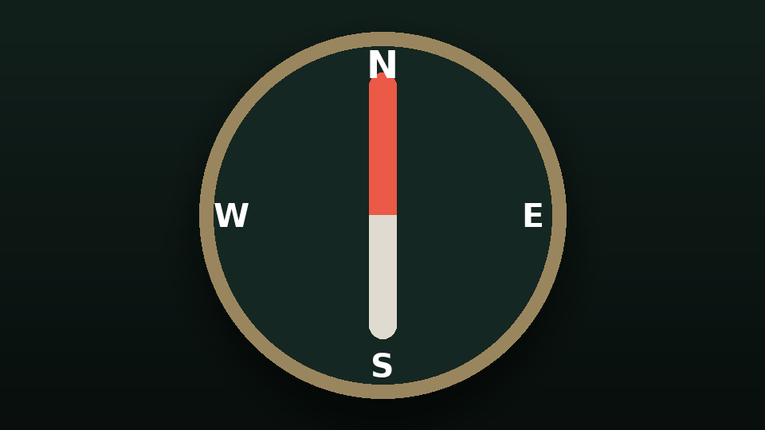

# Simple Compass

A [Timberborn](https://timberborn.com/) mod that adds a small draggable compass to your HUD. Its needle always points to true north, updating live as you pan, zoom, and rotate the camera. Drag it anywhere on screen, then double-click to pin it in place — it remembers its position and pinned state between sessions. Styled to match the game's own UI.



## Features

- Needle always points to true north, regardless of camera pan/zoom/rotation.
- Left-click and drag anywhere on the dial to reposition it.
- Double-click to pin it in place — the ring turns solid gold while pinned, dim white while free to drag.
- Position and pinned state are remembered between sessions.
- Styled to match the game's own UI theme (colors and font sampled directly from the game's assets), rather than custom art.

## Installation

### Steam Workshop

*(Coming soon — link will go here once published.)*

### mod.io

*(Coming soon — link will go here once published.)*

### Manual install (build from source)

This repo is not itself a mod folder — it's built, and the build deploys the result into your Timberborn `Mods` directory for you. Requires the [.NET SDK](https://dotnet.microsoft.com/download) and a local Timberborn install.

```bash
git clone <this repo>
cd timberborn-simple-compass-mod
```

Then, from the repo root:

| Platform | Command |
| --- | --- |
| Linux / macOS | `./scripts/build.sh` |
| Windows (PowerShell) | `.\scripts\build.ps1` |

Either script runs the unit tests first — if they fail, nothing is built or deployed — then builds the mod and copies the DLL, `manifest.json`, and `thumbnail.png` into your Timberborn `Mods/SimpleCompass` folder. Equivalent to running these two commands directly:

```bash
dotnet test tests/SimpleCompass.Tests.csproj
dotnet build SimpleCompass.csproj
```

Then launch the game and enable the mod from the in-game Mod Manager.

#### Game install / Mods folder locations

The build needs to find your Timberborn install (to compile against its DLLs) and your Mods folder (to deploy into). Both have sensible per-OS defaults built in:

| Platform | `TimberbornDir` (game install) | `TimberbornModsDir` |
| --- | --- | --- |
| Windows | `C:\Program Files (x86)\Steam\steamapps\common\Timberborn` | `%USERPROFILE%\Documents\Timberborn\Mods` |
| macOS | `~/Library/Application Support/Steam/steamapps/common/Timberborn` | `~/Documents/Timberborn/Mods` |
| Linux (Steam Play/Proton — Timberborn has no native Linux build) | `~/.steam/debian-installation/steamapps/common/Timberborn` | `~/.steam/debian-installation/steamapps/compatdata/1062090/pfx/drive_c/users/steamuser/Documents/Timberborn/Mods` |

If yours lives somewhere else (a non-default Steam library, GOG/Epic, a different Proton prefix), override either with an MSBuild property, passed through the scripts or straight to `dotnet build`:

```bash
./scripts/build.sh -p:TimberbornDir="D:\Games\Timberborn" -p:TimberbornModsDir="D:\Documents\Timberborn\Mods"
```

### Running just the tests

The unit tests cover the mod's pure compass/positioning math (`source/CompassGeometry.cs`) and have no dependency on Unity, Timberborn, or a game install — they run anywhere the .NET SDK is installed:

```bash
dotnet test tests/SimpleCompass.Tests.csproj
```

### Cleaning up build output

`bin/` and `obj/` (repo root and `tests/`) are gitignored, but if you want to clear them out locally:

| Platform | Command |
| --- | --- |
| Linux / macOS | `./scripts/clean.sh` |
| Windows (PowerShell) | `.\scripts\clean.ps1` |

This only removes local build output — it doesn't touch your Timberborn `Mods` folder or `workshop_data.json`.

### Releasing (maintainers)

Steam Workshop publishing happens through Timberborn's in-game Mod Manager (see [Timberborn's modding wiki](https://github.com/mechanistry/timberborn-modding/wiki) for details). mod.io has no equivalent in-game flow — releases there are a manual ZIP upload at [mod.io/g/timberborn](https://mod.io/g/timberborn), of exactly the three files a Mods folder needs: the built DLL, `manifest.json`, and `thumbnail.png`.

`scripts/release.*` runs the tests, builds a Release build, and packages those three files into `release/SimpleCompass.zip`, with everything rooted under a `SimpleCompass/` folder so the ZIP can be dropped straight into a `Mods` directory:

| Platform | Command |
| --- | --- |
| Linux / macOS | `./scripts/release.sh` |
| Windows (PowerShell) | `.\scripts\release.ps1` |

Bump `Version` in `manifest.json` and add an entry to `CHANGELOG.md` before running it.

## Changelog

See [CHANGELOG.md](CHANGELOG.md).

## License

[MIT](LICENSE)
